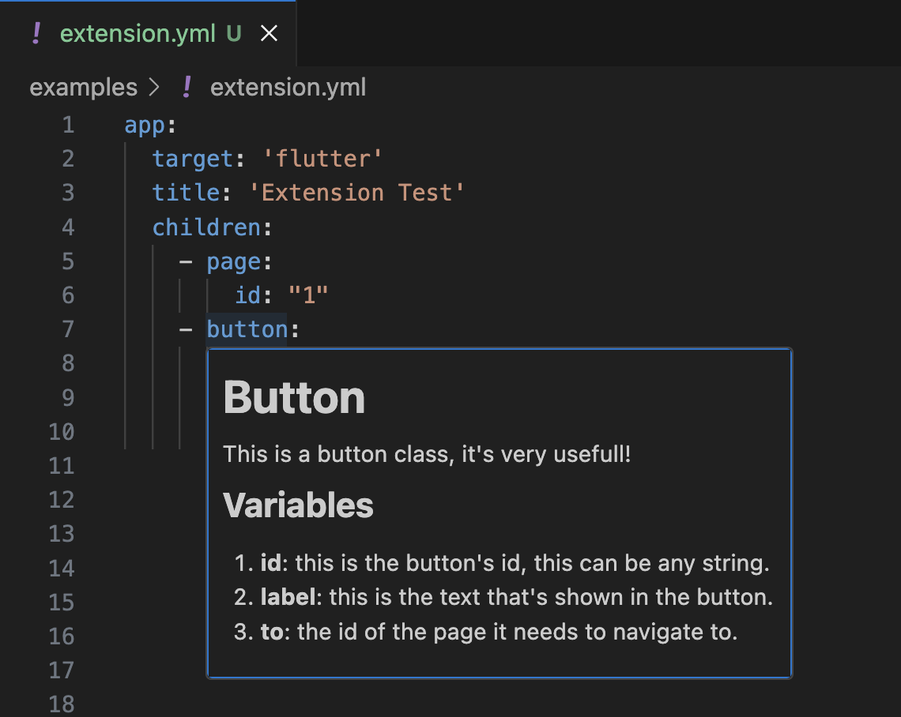

# Appgenerator Docs Extension

This extension is made for the [HydroPlatform repository](https://github.com/SiebeBosch/HydroPlatform). It helps the end user by providing documentation when creating apps in a .yaml or .yml file. 

## Features

When editing a .yaml or .yml file, a pop-up window with documentation will open when hovering over a key. For instance, when hovering over `button`, the extension will open the documentation for the button in a pop-up window.

## How to install

1. Download the extension through this [link](https://github.com/Iconica-Development/appgenerator-docs-vsc-extension/raw/refs/heads/master/appgenerator-docs-0.0.1.vsix).
2. Go to the Extensions view.
3. Select Views and More Actions...
4. Select Install from VSIX...
5. Select the extension that was downloaded in step 1.